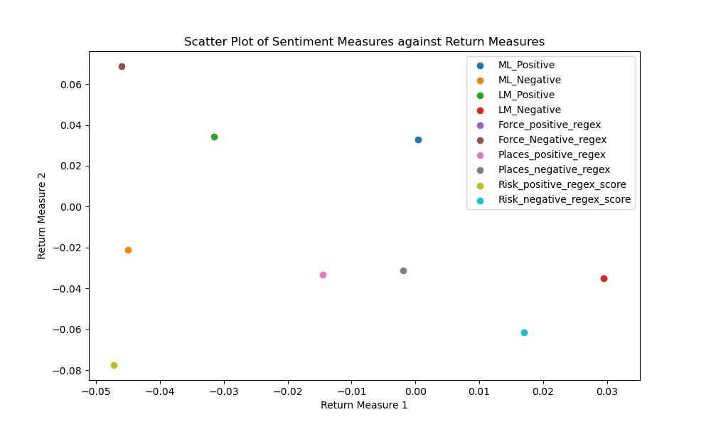

## About Me

Nice to meet you!

My name is Jinyi Xu, and I am currently a senior at Lehigh University, pursuing dual degrees in finance and mathematics. I have been actively involved in various projects that enhance my data analysis skills in Lehigh University. In 2022, I also had the opportunity to intern at KPMG China as a technical consultant.

In my free time, I enjoy singing and dancing. I joined the Lehigh University Choir in my freshman year and have participated in several dance clubs throughout my time at Lehigh.

  

---
## Portfolio

<!-- You can link to other websites, PDFs in this repo, and other pages in this repo -->

_**[Fin377-NLP of 10-K Reports Project](report.md)**_

This report delves into the risk factors in 10-K filings using advanced natural language processing technologies. It includes parsing the file paths of 10-K documents to retrieve data and conducting sentiment analysis on the report content. Through this analysis, we can deeply understand the latent risks in financial disclosures and evaluate the positive and negative discussions surrounding key topics, showcasing the potential of NLP to transform traditional financial analysis.

---

_**[Machine Learning Practice](Machine Learning Practice.md)**_

This assignment progressively explores machine learning, beginning with foundational concepts such as data preprocessing and basic model training. It advances to more complex techniques and diverse models, incorporating sophisticated validation methods. The course culminates in the optimization of models through advanced feature selection and hyperparameter tuning.

---

_**[Eventual team project](https://donbowen.github.io/teamproject/)**_

---

## Career Objectives

With a solid foundation in mathematical theories and modeling from my Mathematics and Business degrees, I have gained a deep understanding of the shift from traditional theory-based business strategies to contemporary data-driven approaches. After graduation, I aspire to work in data analysis within a financial company. I am committed to using my statistical knowledge and coding skills to make meaningful contributions to human life, aligning my career goals with practical changes in the business world.

---

## Hobbies

I enjoy singing and dancing, and have been an active member of the Lehigh University Choir since my freshman year. Additionally, I have participated in several dance clubs throughout my time at Lehigh, balancing academic responsibilities with numerous dance rehearsals and performances.

---

Page template forked from <a href="https://github.com/evanca/quick-portfolio">evanca</a>

<!-- Remove above link if you don't want to attibute -->
